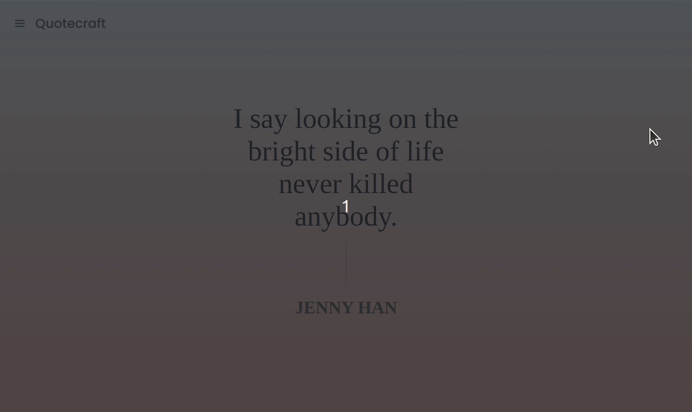
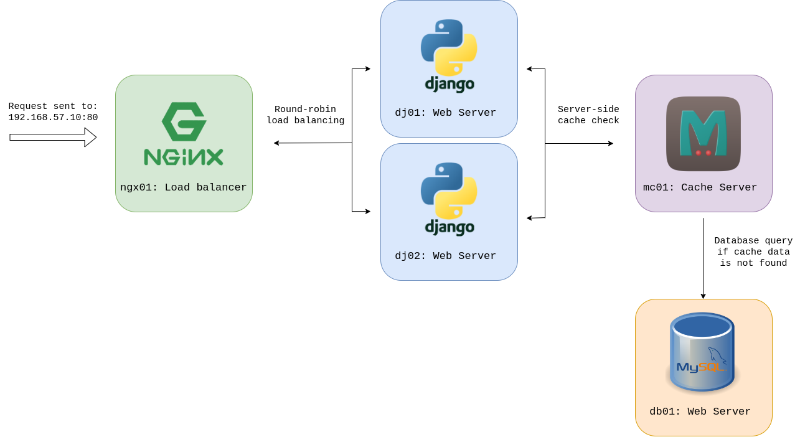

# Quotecraft Vagrant Provisioning

Quotecraft is a customizable quote collection website developed using the Python Django framework. This project is designed to provide a scalable and robust web application for managing and displaying quotes. 



## Architecture Overview



The architecture consists of the following components:

- **ngx01**: Nginx Load Balancer
  - Balances incoming traffic between two Django web servers.
- **dj01** and **dj02**: Django Servers
  - Serve the Quotecraft web application, handle user requests, and communicate with the cache server and the database.
- **mc01**: Memcached Server
  - Sits in front of the database, caches recently accessed data to improve performance.
- **db01**: MariaDB MySQL Database
  - Stores quote data and interacts with Django servers.


## Vagrant Provisioning Mechanism

The project's focus lies in the seamless provisioning of virtual machines. Each component of the architecture is presented by a linux virtual machine, and they are provisioned by associated bash scripts.

Therefore, the deployment process of the application is fairly simple:

1. **Cloning the Repository:**
   ```sh
   git clone https://github.com/cojuny/quotecraft.git
2. **Install Vagrant:**
   
   https://developer.hashicorp.com/vagrant/downloads?product_intent=vagrant
4. **Install Virtualbox:**
   
   https://www.virtualbox.org/wiki/Downloads
6. **Run Vagrantfile:**
  ```sh
   vagrant up
